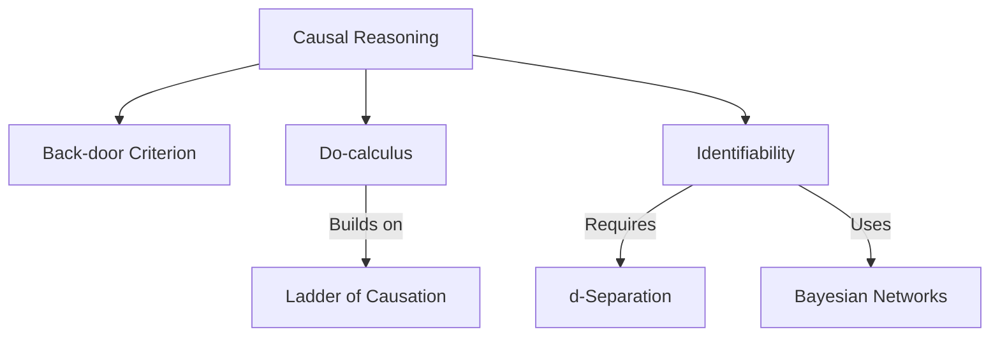
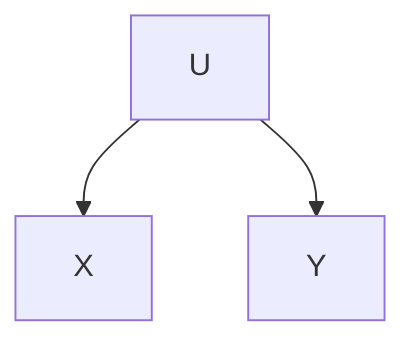
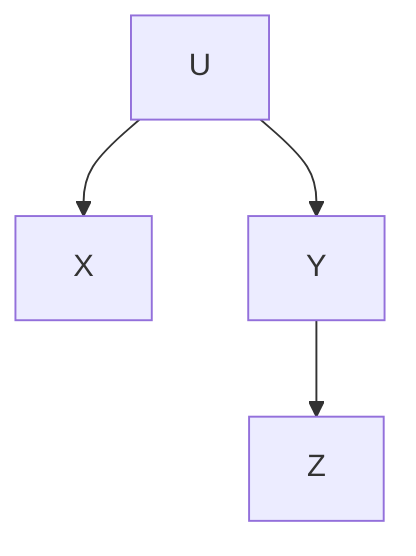

# Technical Hierarchy

# Identifiability in Markovian Causal Models

A **Markovian causal model** (also called *recursive* or *fully specified*) is given by a pair $(G,\mathcal{F})$, where:

-   $G=(V,E)$ is a directed acyclic graph (DAG) with nodes $V=\{X\_1,\dots,X\_n\}$.
-   $\mathcal{F}=\{f\_i\}\_{i=1}^n$ are structural functions $$X\_i = f\_i\bigl(X\_{\mathrm{Pa}(i)}, U\_i\bigr),$$
where $\mathrm{Pa}(i)\subset V\setminus\{X\_i\}$ are the parents of $X\_i$ in $G$, and $U\_1,\dots,U\_n$ are mutually independent exogenous noise variables.

------------------------------------------------------------------------

## 1.1 Factorization & Intervention

By construction, the joint observational density factorizes as

$$
  P(x\_1,\dots,x\_n) = \prod\_{i=1}^n P\bigl(x\_i \mid x\_{\mathrm{Pa}(i)}\bigr).
$$

An intervention `do(X_k = x')` replaces the $k$ th equation by $X_k \leftarrow x'$. Denoting by $G_{\overline{k}}$ the graph obtained by deleting all incoming edges into $X_k$, the post-intervention distribution is

$$
  P\bigl(x_1,\dots,x_n \mid \mathrm{do}(X_k=x')\bigr)
  = \delta_{x_k,x'}\prod_{i\neq k} P\bigl(x_i \mid x_{\mathrm{Pa}(i)}\bigr),
$$

where $\delta_{x_k,x'}=1$ if $x_k=x'$, else $0$.

------------------------------------------------------------------------

## 1.2 Formal Definition of Identifiability

A causal effect $P(Y\mid\mathrm{do}(X=x))$ is **identifiable** in $(G,\mathcal{F})$ if there exists a functional $\Phi$ such that for any structural functions and any distributions of the $U_i$ consistent with $G$, the interventional distribution can be written purely in terms of the observational distribution $P(V)$:

$$
  P\bigl(Y=y \mid \mathrm{do}(X=x)\bigr) = \Phi\bigl(P(V)\bigr).
$$

Equivalently, two models $(G,\mathcal{F})$ and $(G,\mathcal{F}')$ that induce the same observational law $P(V)$ must also induce the same $P(Y\mid\mathrm{do}(X))$.

------------------------------------------------------------------------

## 1.3 Do-Calculus: Three Transformation Rules

Pearl’s **do-calculus** provides syntactic rules to transform expressions with `do(·)` into purely observational terms, using d-separation checks on modified graphs. Denote by:

-   $G_{\overline{X}}$: graph with all edges *into* nodes in $X$ removed.
-   $G_{\underline{Z}}$: graph with all edges *out of* nodes in $Z$ removed.
-   $G_{\overline{X},\underline{Z}}$: apply both operations.

Let $W,Z$ be disjoint sets not containing $X$ or $Y$. The rules are:

1.  **Insertion/deletion of observations**\
    $$P(y \mid \mathrm{do}(x), z, w)
      = P(y \mid \mathrm{do}(x), w)
      \quad\text{if}\quad
      (Y \perp Z \mid X,W)\text{ in }G\_{\overline{X}}.$$

2.  **Action/observation exchange**\
    $$P(y \mid \mathrm{do}(x), \mathrm{do}(z), w)
      = P(y \mid \mathrm{do}(x), z, w)
      \quad\text{if}\quad
      (Y \perp Z \mid X,W)\text{ in }G\_{\overline{X},\underline{Z}}.$$

3.  **Insertion/deletion of actions**\
    $$P(y \mid \mathrm{do}(x), \mathrm{do}(z), w)
      = P(y \mid \mathrm{do}(x), w)
      \quad\text{if}\quad
      (Y \perp Z \mid X,W)\text{ in }G\_{\overline{X},\overline{Z(W)}}.$$

Here $(A\perp B \mid C)$ means $A$ is d-separated from $B$ given $C$. By applying these rules, one eliminates `do(·)` operators to obtain observational expressions.

------------------------------------------------------------------------

## 1.4 The ID Algorithm (Sketch)

The **ID algorithm** is a recursive procedure to identify $P(Y\mid\mathrm{do}(X))$:

1.  **Base:** If $X=\emptyset$, return $\sum_{V\setminus Y}P(V)$.\
2.  **Ancestral reduction:** Restrict to subgraph on ancestors of $Y$.\
3.  **C-component decomposition:** Factor across confounded components after removing incoming $X$-edges.\
4.  **Do-calculus step:** Find $Z$ permitting a rule to remove an intervention; apply and recurse.\
5.  **Fail:** If no rule applies, conclude non-identifiability.

This algorithm is *complete* for Markovian models: it succeeds precisely when $P(Y\mid\mathrm{do}(X))$ is identifiable.

------------------------------------------------------------------------

# 2. The Back-Door Criterion

While do-calculus handles arbitrary DAGs, the **back-door criterion** gives a simpler sufficient condition via covariate adjustment.

------------------------------------------------------------------------

## 2.1 Definition

Let $G$ be a DAG and $X,Y$ disjoint. A set $Z\subset V\setminus\{X,Y\}$ satisfies the **back-door criterion** if:

1.  No member of $Z$ is a descendant of $X$.\
2.  $Z$ blocks every path from $X$ to $Y$ starting with an arrow into $X$ (back-door paths).

Blocking uses d-separation: chains ($A\to B\to C$) or forks ($A\leftarrow B\to C$) are blocked by $B\in Z$, while colliders ($A\to B\leftarrow C$) are blocked by $B\notin Z$ and no descendant in $Z$.

------------------------------------------------------------------------

## 2.2 Adjustment Formula

If $Z$ satisfies the back-door criterion, then:

$$
  P\bigl(Y=y \mid \mathrm{do}(X=x)\bigr)
  = \sum_z P\bigl(Y=y \mid X=x, Z=z\bigr)\,P(Z=z).
$$

**Proof Sketch:**\
1. In $G_{\overline{X}}$, d-separation implies $P(y\mid\mathrm{do}(x),z)=P(y\mid x,z)$.\
2. Since $Z$ has no edges from $X$, $P(z\mid\mathrm{do}(x))=P(z)$.\
3. Marginalize: $P(y\mid\mathrm{do}(x))=\sum_z P(y\mid x,z)P(z)$.

------------------------------------------------------------------------

## 2.3 Illustrative Diagrams

**1. Simple Confounding (non-identifiable)**

**2. Adjustment via Z**

Here $Z$ blocks the back-door path $X \leftarrow U \to Y$ and is not a descendant of $X$.
