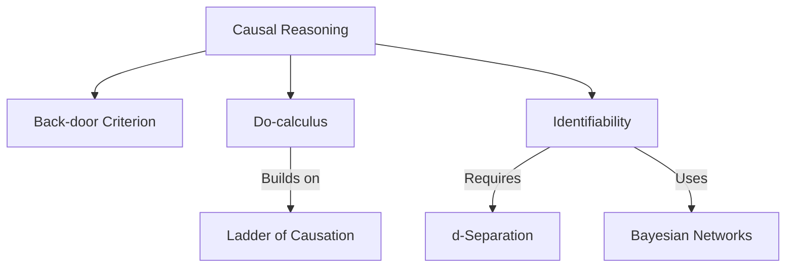

# Technical Hierarchy

```mermaid
graph TD
    A[Causal Reasoning] --> B[Back-door Criterion]
    A --> C[Do-calculus]
    A --> D[Identifiability]
    D -->|Requires| F[d-Separation]
    D -->|Uses| G[Bayesian Networks]
    C -->|Builds on| H[Ladder of Causation]
```
