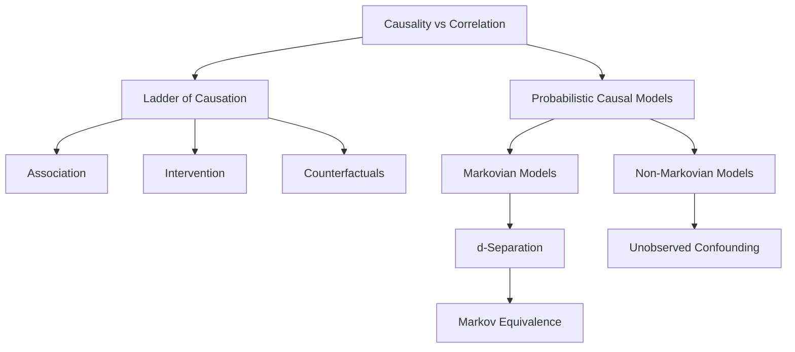
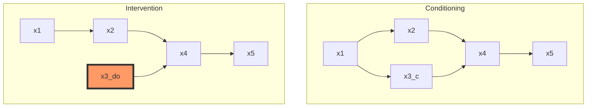

## Comprehensive Technical Summary
This section provides a rigorous introduction to causal inference from the perspective of structural models and graphical representations. The primary goal is to distinguish causation from mere association, and to establish a formal language and mathematical apparatus to model, reason about, and compute causal relationships.

## 1. Causality versus Correlation

Statistical correlation measures the degree of association between two variables, but it does not imply that one variable causes the other. Mathematically, the correlation coefficient between two random variables $X$ and $Y$ is defined as:

$$
\mathrm{Corr}(X, Y) = \frac{\mathbb{E}[(X - \mu_X)(Y - \mu_Y)]}{\sigma_X \sigma_Y},
$$

where $\mu_X$ and $\mu_Y$ are the means, and $\sigma_X$ and $\sigma_Y$ are the standard deviations of $X$ and $Y$, respectively. However, high correlation may be due to confounding variables, reverse causation, or mere coincidence. Causal inference aims to answer a fundamentally different question: *what happens to* $Y$ if we intervene on $X$? This calls for a formal framework that can handle interventions rather than just passive observations.

#### A Classic Example

To understand the difference between correlation and causation, consider the classic example of **ice cream sales** and **drowning incidents**. Empirically, one might observe a strong positive correlation between the number of ice creams sold on a given day and the number of drownings reported. That is, when ice cream sales go up, drowning incidents also tend to go up. Mathematically, this can be expressed as a high Pearson correlation coefficient:

$$
\mathrm{Corr}(X, Y) > 0,
$$

where \( X \) is the number of ice creams sold and \( Y \) is the number of drownings. However, interpreting this correlation as a causal relationship would be a mistake. Selling more ice cream does **not** cause people to drown.

The underlying issue is that both variables are influenced by a **confounding variable** — in this case, **temperature** or **season**. During the summer, temperatures are higher, which increases both the demand for ice cream and the number of people swimming, thereby increasing the risk of drowning. Thus, the variable "season" or "temperature" acts as a **common cause** of both \( X \) and \( Y \).

In causal terms, the correct structure is captured by a causal graph with directed edges from the variable $Z = \text{Temperature}$ to both \( X \) and \( Y \):

$$
Z \rightarrow X, \quad Z \rightarrow Y.
$$

There is **no** causal arrow from \( X \) to \( Y \). Therefore, even though the marginal correlation $P(Y \mid X)$  is high, the **causal effect** $P(Y \mid \text{do}(X))$ — which represents what would happen to \( Y \) if we forced \( X \) to change — is essentially **null**. Intervening on ice cream sales (e.g., banning ice cream) would not reduce drowning incidents because the true cause lies elsewhere.

## 2. Structural Causal Models (SCMs)

To model causality formally, we use Structural Causal Models (SCMs), which combine functional equations with a graphical representation. An SCM is defined as a triplet $(U, V, F)$, where $U = \{U_1, \dots, U_n\}$ is a set of exogenous (latent or unobserved) variables that capture external sources of randomness, $V = \{X_1, \dots, X_m\}$ is a set of endogenous (observed) variables, and $F = \{f_1, \dots, f_m\}$ is a set of deterministic or stochastic functions. Each function $f_i$ determines the value of variable $X_i$ based on its parents in the graph and its own exogenous noise term $U_i$:

$$
X_i = f_i(\mathrm{pa}_i, U_i),
$$

where $\mathrm{pa}_i \subseteq V$ denotes the parents of $X_i$ in the causal graph (a directed acyclic graph, or DAG). The entire system of equations induces a joint distribution over $V$ and $U$, and ultimately over all observables.

## 3. Interventions and the Do-Operator

The essence of causality is captured by reasoning about interventions. To formally express interventions, we introduce Pearl’s **do-operator**, denoted $\text{do}(X = x)$. This operator represents an *external intervention* that sets the variable $X$ to a fixed value $x$, regardless of its usual causes. The post-intervention distribution of another variable $Y$, given the intervention, is written as:

$$
P(Y \mid \text{do}(X = x)).
$$

This distribution is not the same as the conditional distribution $P(Y \mid X = x)$, which is purely observational. To compute $P(Y \mid \text{do}(X = x))$, we define a new submodel $M_{X \leftarrow x}$, where the structural equation for $X$ is replaced by the constant assignment $X := x$, and all incoming edges into $X$ are removed from the DAG. The rest of the model remains unchanged, allowing us to recompute the distribution of $Y$ under this hypothetical manipulation.

In the right graph ("Conditioning"), variable \( x_3 \) is observed (conditioned on), which updates beliefs but does not alter the causal mechanism.  
In the left graph ("Intervention"), variable \( x_3 \) is **intervened on** using $\text{do}(x_3)$, which severs the incoming causal edge from \( x_1 \).  
This highlights the fundamental distinction between **conditioning** and **intervening** in causal inference.

## 4. Do-Calculus: Formal Rules of Intervention

Pearl's do-calculus provides a set of three transformation rules that enable the simplification of expressions involving the do-operator. These rules are sound under the structural causal model semantics and enable the derivation of interventional quantities from purely observational data, under suitable assumptions. The first rule allows for the insertion or deletion of observations, given conditional independencies in the mutilated graph (a graph with some edges removed). The second rule relates actions (interventions) and observations when certain graphical conditions hold. The third rule permits the insertion or deletion of actions under specific independence assumptions. These rules are formalized in terms of conditional independence relations that can be read from the DAG using d-separation.
